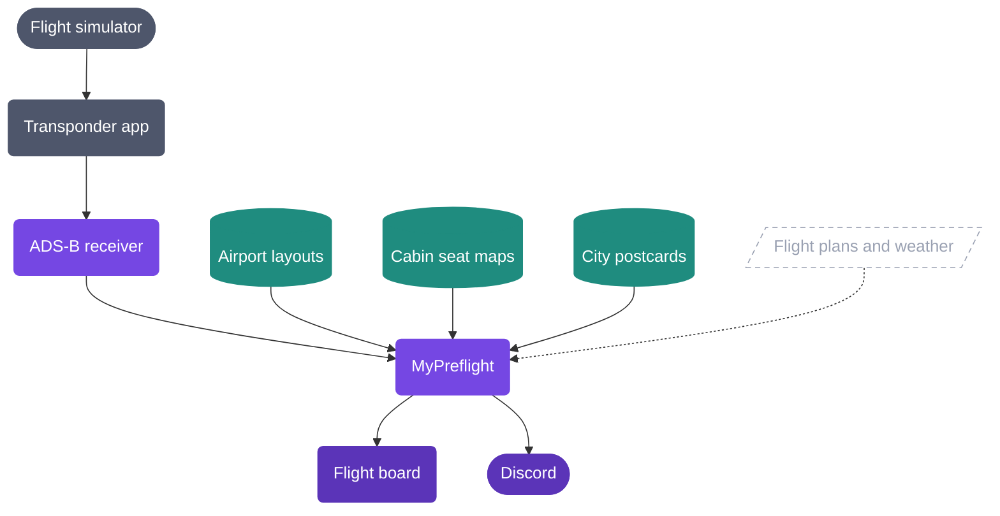

# MyPreflight

### Fly your simulator the way an airline pilot flies it.

MyPreflight is a preflight briefing service, electronic flight board, and digital logbook for virtual pilots. Load up 
your flight plan and receive a passenger list, cargo manifest, airport information brief. Review your landing, build 
your virtual career, by enhancing your awareness from flight dispatch to the passengers disembarking.

[**mypreflight.io**](https://mypreflight.io)

---

## The platform

MyPreflight turns a simulator into a true-to-life airline-duty experience.

Load your SimBrief flight plan, pick up an aircraft, a crew, get the docs: 
the flight plan, the weather at both ends, the airport layout, the cabin. Then check-in, boarding,
off-block, airborne, on-block. Every stage is timed, and the paperwork fills itself in as the numbers
become final.

While you fly, a small app on your PC reports where you are. Your flight appears on a live map, anyone
can follow it through a link you share, and Discord tells your friends what you are flying.

`Dispatch` → `Brief` → `Board passengers and cargo` → `Taxi` → `Fly` → `Land` → `Disembark`

## How it fits together

Your simulator feeds a small app on your PC, which reports your position to our receiver. The core
service puts that together with everything else a flight needs — airports, cabins, flight plans,
weather — and pushes the result to the web dashboard.

## Repositories

### The product

| Repository                              | What it is                                                                                                                                   |
|-----------------------------------------|----------------------------------------------------------------------------------------------------------------------------------------------|
| [**flight-tracker-app**][repo-app]      | The flight board itself. Dispatch, briefing, boarding, the live map and the airport library — in the browser, and installable on your phone. |
| [**flight-tracker-api**][repo-api]      | The engine behind it. Holds every flight, its timings, its paperwork and its weather, and keeps every screen in sync as the flight moves.    |
| [**transponder-app**][repo-transponder] | A single-file Windows app. Reports your position from the simulator, sets your Discord status, and prints your documents on real hardware.   |
| [**adsb-receiver-api**][repo-adsb]      | Our ground station. Real receivers listen to the radio; this one listens over the internet.                                                  |

### Data services

| Repository                               | What it is                                                                                |
|------------------------------------------|-------------------------------------------------------------------------------------------|
| [**osm-provider**][repo-osm]             | Airport layouts — runways, terminals, stands and gates.                                   |
| [**aerolopa-provider**][repo-aerolopa]   | Cabin seat maps and configurations for over 120 airline carriers ans 1600 aircrafts total |
| [**postcard-generator**][repo-postcard]  | Draws a travel poster for every city you fly to — one collectible per destination.        |
| [**flight-tracker-etl-tools**][repo-etl] | In-house tools that keep our airline and aircraft reference lists tidy.                   |

---

Built by [Oskar Barcz](https://github.com/oskarbarcz) &nbsp;·&nbsp; [mypreflight.io](https://mypreflight.io)

[repo-app]: https://github.com/oskarbarcz/flight-tracker-app
[repo-api]: https://github.com/oskarbarcz/flight-tracker-api
[repo-adsb]: https://github.com/oskarbarcz/adsb-receiver-api
[repo-etl]: https://github.com/oskarbarcz/flight-tracker-etl-tools
[repo-transponder]: https://github.com/mypreflight/transponder-app
[repo-osm]: https://github.com/mypreflight/osm-provider
[repo-aerolopa]: https://github.com/mypreflight/aerolopa-provider
[repo-postcard]: https://github.com/mypreflight/postcard-generator
